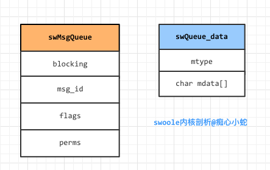

```
原创内容，转载请注明出处, 谢谢~
```

## 2.4 消息队列

* 进程间通信(IPC)的一种形式
* 消息队列允许进程以消息的形式交换数据
* 消息队列是面向消息的，发送和接受只能是一块完整的消息
* 即可以先入先出读取，也可以安照类型读取

~~~c
typedef struct _swQueue_Data
{
    long mtype;                      // 接受还是发送消息
    char mdata[sizeof(swEventData)]; // 消息文本数据
} swQueue_data;

typedef struct _swMsgQueue
{
    int blocking;  // 是否阻塞
    int msg_id;    // 消息id
    int flags;     // 标签
    int perms;     // 权限
} swMsgQueue;
~~~

`swoole`的消息队列是对`System V 消息队列`的一层抽象封装。`System V 消息队列`底层的优缺点就是`swoole`消息队列的优缺点。`System V 消息队列`在操作系统内核中是一个链表结构。

> 结构图



在`swMsgQueue`结构体中
* `blocking`标明该消息队列是否阻塞
* `msg_id`是创建消息队列是返回的消息id
* `flags`在`msgsnd`和`msgrcv`底层函数中使用
* `perms`是表示对消息队列的操作权限

在`swQueue_data`结构体中
* mtype 表明类型，用来在接收和发送消息中使用
* mdata 就是具体的消息队列数据

### 基本函数

~~~c
// 创建消息队列
int swMsgQueue_create(swMsgQueue *q, int blocking, key_t msg_key, int perms);
// 设置消息队列是否阻塞
void swMsgQueue_set_blocking(swMsgQueue *q, uint8_t blocking);
// 推入消息
int swMsgQueue_push(swMsgQueue *q, swQueue_data *in, int data_length);
// 弹出消息
int swMsgQueue_pop(swMsgQueue *q, swQueue_data *out, int buffer_length);
// 消息队列状态
int swMsgQueue_stat(swMsgQueue *q, int *queue_num, int *queue_bytes);
// 释放消息队列
int swMsgQueue_free(swMsgQueue *q);
~~~

### 详细讲解

* `int swMsgQueue_create(swMsgQueue *q, int blocking, key_t msg_key, int perms)`

~~~c
int swMsgQueue_create(swMsgQueue *q, int blocking, key_t msg_key, int perms)
{
    if (perms <= 0 || perms >= 01000)
    {
        perms = 0666;
    }
    int msg_id;
    // 获取消息队列
    msg_id = msgget(msg_key, IPC_CREAT | perms); // IPC_CREAT 如果没有给定的消息队列，就创建
    if (msg_id < 0)
    {
        swSysError("msgget() failed.");
        return SW_ERR;
    }
    else
    {
        bzero(q, sizeof(swMsgQueue));
        q->msg_id = msg_id;
        q->perms = perms;
        q->blocking = blocking;

        // 是否阻塞操作
        swMsgQueue_set_blocking(q, blocking);
    }
    return 0;
}

void swMsgQueue_set_blocking(swMsgQueue *q, uint8_t blocking)
{
    if (blocking == 0)
    {
        q->flags = q->flags | IPC_NOWAIT; // 不等待，不阻塞
    }
    else
    {
        q->flags = q->flags & (~IPC_NOWAIT); // 等待
    }
}
~~~

使用`msgget`系统调用创建一个消息队列，返回消息id，同时更新消息队列结构体的属性值，并调用`swMsgQueue_set_blocking`更新消息结构体的`flags`属性

* `int swMsgQueue_push(swMsgQueue *q, swQueue_data *in, int length)`

~~~c
int swMsgQueue_push(swMsgQueue *q, swQueue_data *in, int length)
{
    int ret;

    while (1)
    {
        ret = msgsnd(q->msg_id, in, length, q->flags); // 该函数永远不会自动重启
        if (ret < 0)
        {
            SwooleG.error = errno;

            if (errno == EINTR) // 因队列满而发生阻塞的时候，可能被信号处理器中断
            {
                continue;
            }
            else if (errno == EAGAIN)  // 非阻塞，就会返回EAGAIN错误
            {
                return -1;
            }
            else
            {
                swSysError("msgsnd(%d, %d, %ld) failed.", q->msg_id, length, in->mtype);
                return -1;
            }
        }
        else
        {
            return ret;
        }
    }
    return 0;
}
~~~

推送数据就是调用`msgsnd`系统调用，因为该函数永远不会重启，即使在信号处理中也是。所以使用了`while(1)`轮询的方法，直到消息发送成功

* `int swMsgQueue_pop(swMsgQueue *q, swQueue_data *data, int length)`

~~~c
int swMsgQueue_pop(swMsgQueue *q, swQueue_data *data, int length)
{
    /*
    
        #include <sys/types.h>
        #include <sys/msg.h>

        ssize_t msgrcv(int msqid, void *msgp, size_t maxmsgsz, long msgtyp, int msgflg);
        读取消息的顺序无需和消息发送的一致
        可以通过mtype来选择消息，由参数msgtyp控制

        msgtyp == 0
            删除消息队列的第一条消息，并返回给调用进程
        msgtyp > 0
            将队列中第一条mtype等于msgtyp的消息删除并返回。
            通过指定不同的msgtyp值，多个进程能够从同一个消息队列中读取消息，而不会出现竞争读取同一条消息的情况
        msgtyp < 0
            将等待消息当成优先队列来处理。队列中mtype最小并且其值小于等于msgtyp的绝对值的第一条消息被删除并返回

     */
    int ret = msgrcv(q->msg_id, data, length, data->mtype, q->flags);
    if (ret < 0)
    {
        SwooleG.error = errno;
        // 没有消息 或者 被中断
        if (errno != ENOMSG && errno != EINTR)
        {
            swSysError("msgrcv(%d, %d, %ld) failed.", q->msg_id, length, data->mtype);
        }
    }
    return ret;
}
~~~

弹出消息，就是调用底层函数`msgrcv`，具体的规则在代码注释中解释的很清楚了。

* `int swMsgQueue_stat(swMsgQueue *q, int *queue_num, int *queue_bytes)`

~~~c
int swMsgQueue_stat(swMsgQueue *q, int *queue_num, int *queue_bytes)
{
    struct msqid_ds __stat;
    if (msgctl(q->msg_id, IPC_STAT, &__stat) == 0)
    {
        // 队列消息个数
        *queue_num = __stat.msg_qnum;
        // 消息队列中所有消息的mtext字段的字节总数定义的一个上限
        *queue_bytes = __stat.msg_cbytes;
        return 0;
    }
    else
    {
        return -1;
    }
}
~~~

获取消息队列的状态，该函数获取消息队列的`消息个数`和`总的消息队列数据字节数`

* `swMsgQueue_free`

~~~c
int swMsgQueue_free(swMsgQueue *q)
{
    if (msgctl(q->msg_id, IPC_RMID, 0) < 0)
    {
        swSysError("msgctl(%d, IPC_RMID) failed.", q->msg_id);
        return SW_ERR;
    }
    return SW_OK;
}
~~~

释放消息队列，使用`msgctl`系统调用，标识符使用`IPC_RMID`

### 具体应用

* 在`swoole`进程池中，如果IPC模式设置为`SW_IPC_MSGQUEUE`，则进程间通信使用到消息队列
