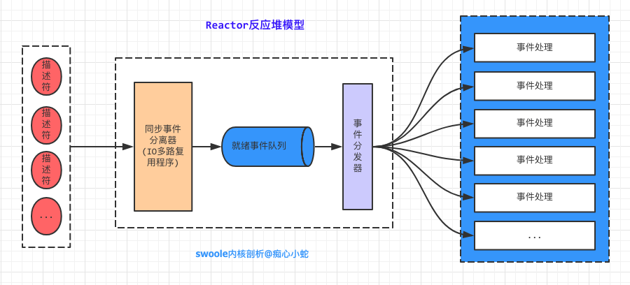

```
原创内容，转载请注明出处, 谢谢~
```

## 3.2 反应堆模型

在反应堆模型中，有4个重要的参与者。

1. 描述符
2. 同步事件分离器(*IO多路复用程序*)
3. 事件分发器
4. 事件处理器

事件本质是对描述符的**操作**的一种抽象，每当描述符(套接字)准备好连接应答(*accept*),可写，可读，关闭时，就会产生一个相关的文件事件，而同步事件分离器(*IO多路复用程序*)就是对这些事件进行监听的。
程序开始的时候，我们首先需要将不同的事件对应的事件处理器注册到反应堆模型上，当反应堆模型产生特定的事件时，事件分发器就会将该事件告知对应的事件处理，该事件处理器开始执行。这里事件分发器是线性处理的，
因为在同步事件分离器，会将准备就绪的事件放入一个操作系统内核的队列中，我们需要一个一个处理。


