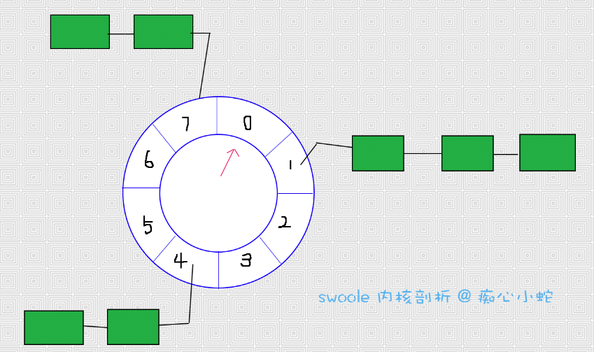

```
原创内容，转载请注明出处, 谢谢~
```

## 8.5 时间轮算法

> `swoole`使用时间轮算法对超时的客户端连接进行踢除。如果`swoole`没有开启时间轮调度算法，默认启用`心跳检测算法`。

在一个网络服务器中，需要管理大量客户端连接，其中每个客户端都要管理它的超时(timeout)时间。当客户端的连接超时之后，
我们就要想办法将其踢除。最原始的方法就是对每一个客户端连接都设置一个`timer`定时器，但客户端连接可以达到百万级别时，
会严重影响服务器的性能，并不现实，这时候就有必要使用`时间轮算法`来优化这一个问题了。

定时轮是一种环形数据结构，其主体是一个循环列表（circular buffer），每个列表中包含一个称之为槽（slot）的结构。至于 slot 的具体结构依赖具体应用场景，可以是链表，也可以是哈希表。

> 逻辑图



这是常规的时间轮结构图，其中槽的部分使用链表实现。

~~~c
typedef struct
{
    uint16_t current;
    uint16_t size;
    swHashMap **wheel;

} swTimeWheel;
~~~

`swoole时间轮结构体`中，current表示当前时间轮指针所在的位置，size表示时间轮有几个槽，wheel表示每个槽具体的数据结构，`swoole`在这里用了哈希表实现。

### 函数原型

~~~c
// 新建时间轮
swTimeWheel* swTimeWheel_new(uint16_t size);
// 释放时间轮
void swTimeWheel_free(swTimeWheel *tw)
// 时间轮前转一格
void swTimeWheel_forward(swTimeWheel *tw, swReactor *reactor)
// 将连接添加到时间轮中
void swTimeWheel_add(swTimeWheel *tw, swConnection *conn)
// 更新连接状态
void swTimeWheel_update(swTimeWheel *tw, swConnection *conn)
// 将连接从时间轮中删除
void swTimeWheel_remove(swTimeWheel *tw, swConnection *conn)
~~~

### 详细讲解

与时间轮相关的接个服务器设置参数

* heartbeat_interval  时间轮指针多久前转一格
* last_heartbeat_time 最后一次进行心跳检测的时间
* heartbeat_idle_time 允许连接的保持空闲的时间

`swoole`在多进程模式中，已连接套接字由每个`线程reactor`维护，如果开启了时间轮算法，在`master进程`的每个`线程reactor`中, 如果`heartbeat_idle_time`大于0，则新建时间轮，并且时间轮和对应的`线程reactor`相绑定。
最后设置`线程reactor`的`onFinish`和`onTimeout`回调函数为`swReactorThread_onReactorCompleted`。
而`onFinish`会在事件循环中，每次事件就绪进行调用。


